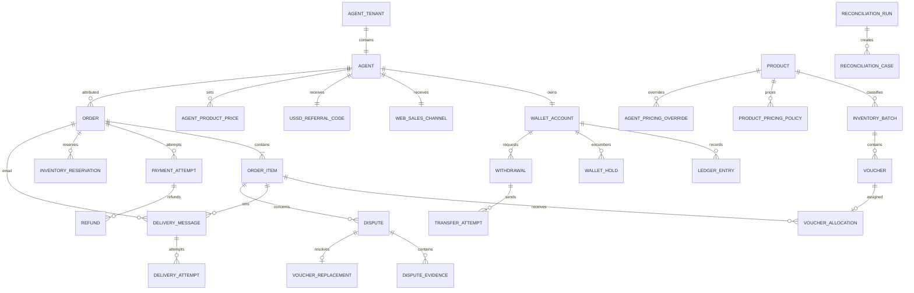

# Logical data model

Status: Accepted direction  
Last updated: 2026-07-30

This is the logical model. Physical Prisma names, indexes, and PostgreSQL types
will be finalized during schema implementation without changing the confirmed
ownership and invariants.

## Global conventions

- Internal primary keys are non-sequential UUIDs.
- Buyer-facing order references are separate high-entropy identifiers.
- Provider references are separate from Dashchecker IDs.
- Monetary values are integer pesewas with currency `GHS`.
- Timestamps are stored in UTC.
- Records use explicit lifecycle state rather than deletion when history must
  remain.
- Financial, inventory, provider-event, and audit histories are append-only.
- Personal data and voucher secrets are encrypted or masked according to their
  classification.
- Public API contracts do not expose ORM entities.

## Relationship overview

## Identity and tenancy

### `AgentTenant`

Owner: Identity

The authorization and data boundary for one individual agent. It has exactly
one `Agent`.

Key constraints:

- one agent per tenant,
- one tenant per agent, and
- tenant identity is immutable.

### `Agent`

Owner: Identity

Contains the individual's name, registered phone in protected canonical form,
masked display form, account state, and timestamps.

Key constraints:

- canonical registered phone is globally unique,
- one phone has one active or suspended agent account,
- account state changes are audited, and
- phone changes use the account-recovery workflow.

Phone history and recovery evidence are retained in explicit recovery/audit
records rather than overwriting history without explanation.

### `OtpChallenge`

Owner: Identity

Represents an agent sign-in, withdrawal step-up, recovery, or buyer voucher
recovery challenge.

Stores purpose, protected destination, one-way code verifier, expiry,
attempt count, consumed time, and abuse-prevention context.

Raw OTP values are never stored.

### `Session`

Owner: Identity

Represents an authenticated agent or internal session with actor, authentication
strength, issue and expiry times, revocation, and relevant device/security
metadata.

### `InternalUser` and `InternalCredential`

Owner: Identity

`InternalUser` identifies an Administrator or Support operator.
`InternalCredential` stores passkey or approved MFA metadata without private
credential material.

No internal account is shared.

## Sales channels

### `WebSalesChannel`

Owner: Agents and sales channels

One permanent web identifier (`webSalesId`) and optional custom subdomain slug (`slug`) for one agent. Includes agent-customizable storefront branding (store name, tagline, logo URL, hero banner URL, WhatsApp contact number, theme preset, and announcement ticker). Subdomains (`https://{slug}.dashchecker.app/`) replace path-based URLs, with legacy `/buy/{id}` requests permanently redirected.

### `UssdReferralCode`

Owner: Agents and sales channels

One permanent USSD code for one agent.

Channel identifiers are globally unique and remain reserved after retirement.
The agent relationship never changes.

## Catalog and pricing

### `Product`

Owner: Catalog and pricing

One of the stable product codes:

- `BECE`
- `WASSCE`
- `NOVDEC_PRIVATE`

Contains buyer-facing name, scope content, availability, and display metadata.

### `ProductPricingPolicy`

Owner: Catalog and pricing

A versioned default base price and maximum retail price for one product with
effective timestamps and Administrator audit source.

Historical policy rows remain available for explanation.

### `AgentPricingOverride`

Owner: Catalog and pricing

A versioned optional base-price or retail-maximum override for one agent and
product, including reason and effective timestamps.

### `AgentProductPrice`

Owner: Catalog and pricing

The agent's active retail price for one product plus its price-change history or
linked audit events.

Key constraints:

- one active price per agent and product,
- effective base price is not greater than effective maximum,
- retail price is within the effective range, and
- automatic clamping is audited.

## Inventory

### `InventoryBatch`

Owner: Inventory

Contains product, vendor, invoice/reference, acquisition date, unit acquisition
cost, import status, uploader, timestamps, and source counts.

### `Voucher`

Owner: Inventory

Contains:

- batch and product,
- encrypted serial number,
- encrypted 12-digit PIN,
- non-reversible serial and PIN fingerprints,
- availability state,
- dispute disposition,
- timestamps, and
- key-version metadata.

Key constraints:

- PIN remains a fixed-length string,
- serial fingerprint is globally unique,
- PIN fingerprint is globally unique,
- product matches its batch,
- sold, replaced, refunded, or void inventory never becomes available, and
- raw values are available only through controlled decryption.

### `InventoryEvent`

Owner: Inventory

Append-only history of import, reserve, release, sell, quarantine, void,
replacement, refund disposition, and controlled correction.

### `InventoryReservation` and `InventoryReservationItem`

Owner: Inventory

The reservation header links an order and payment attempt to an expiry and
state. Item rows link the complete reserved voucher set.

Key constraints:

- requested quantity is reserved completely or not at all,
- one voucher has at most one active reservation,
- reservation product matches order product,
- only its payment/order flow can consume the reservation, and
- release and consumption are terminal.

## Orders and itemized fulfillment

### `Order`

Owner: Orders

Contains:

- high-entropy public reference,
- tenant, agent, and sales-channel snapshots,
- one product,
- quantity from one to five,
- currency,
- aggregate price snapshots,
- protected delivery phone and mask,
- optional protected delivery email and mask,
- protected payer phone and mask,
- payer network,
- creation and price-expiry times,
- accepted payment-attempt reference, and
- derived commercial status fields where needed for querying.

The order never stores a raw synthetic Paystack email as buyer contact data.

### `OrderItem`

Owner: Orders

One row per purchased voucher unit. A quantity-five order has positions one
through five.

Each item stores:

- order and position,
- product,
- unit base-price snapshot,
- unit retail-price snapshot,
- unit agent-profit snapshot,
- fulfillment and dispute disposition, and
- timestamps.

Key constraints:

- unique order and position,
- position is between one and order quantity,
- item count equals order quantity,
- item product matches order product,
- retail equals base plus agent profit, and
- values are immutable after creation.

### `VoucherAllocation`

Owner: Inventory, coordinated by Fulfillment

Links one voucher to one order item as original or replacement allocation.

Key constraints:

- one voucher is allocated at most once,
- allocation product matches order item product,
- one current fulfilled voucher exists per order item,
- replacement preserves prior allocation history, and
- allocation never changes agent attribution or profit.

## Payments and refunds

### `PaymentAttempt`

Owner: Payments

Contains order, attempt number, unique Paystack reference, synthetic email,
expected amount and currency, normalized provider state, provider identifiers,
authorization/reconciliation timestamps, and excess-payment classification.

Key constraints:

- attempt number is unique within order,
- no more than three attempts per order,
- one non-terminal attempt per order,
- provider reference is globally unique, and
- accepted payment is linked to the order exactly once.

More than one provider attempt may report success unexpectedly. Only the
order's accepted attempt causes fulfillment; later successes are excess
payments.

### `PaymentEvent`

Owner: Payments

Append-only receipt of authenticated webhook or verification results with
provider event identity, safe payload reference, receive time, processing
result, and idempotency.

### `Refund`

Owner: Payments

Represents an excess-payment, full-order, or order-item refund with amount,
reason, payment attempt, optional order item, provider reference, state, and
wallet-effect link.

Key constraints prevent refunding or reversing the same entitlement twice.

## Delivery and recovery

### `DeliveryMessage`

Owner: Delivery

Represents:

- one voucher SMS for one order item,
- one all-voucher optional email for an order, or
- an approved status or notification message.

Stores channel, scope, protected destination, template/version, state, and safe
content metadata. Raw voucher message bodies are not persisted in ordinary
logging fields.

### `DeliveryAttempt`

Owner: Delivery

Append-only provider submissions and reconciliation results with stable client
reference, provider message reference, attempt number, timestamps, normalized
state, and safe error classification.

### `RecoveryChallenge`

Owner: Delivery

Links an order-reference recovery request to a delivery-phone OTP challenge,
rate-limit context, and successful recovery audit.

It never changes order destinations.

## Wallet and withdrawal

### `WalletAccount`

Owner: Wallet and ledger

One account per agent and currency. It does not store an operator-editable
balance.

### `LedgerEntry`

Owner: Wallet and ledger

Append-only signed amount in pesewas with:

- entry type,
- wallet,
- business source type and ID,
- order or withdrawal links where applicable,
- created time,
- reversal or compensation relationship, and
- immutable explanatory metadata.

Key constraints:

- one sale credit per fulfilled order,
- one payment-reversal debit per provider reversal,
- one refund-profit debit per refunded order item,
- one payout and fee debit per successful withdrawal, and
- one compensation per returned transfer movement.

### `WalletHold`

Owner: Wallet and ledger

Encumbers payout plus fee for one withdrawal. Active holds reduce withdrawable
funds but do not mutate posted ledger balance.

One withdrawal has at most one active hold. Release or consumption is terminal.

### `Withdrawal`

Owner: Withdrawals

Contains wallet, agent, protected destination snapshot, network, requested net
payout, fee, total hold, state, Administrator decision, and timestamps.

### `TransferRecipient`

Owner: Withdrawals

Represents the Paystack recipient for the agent's current registered phone and
network. It is invalidated when the registered phone changes.

### `TransferAttempt`

Owner: Withdrawals

Contains withdrawal, unique Paystack reference, recipient code, transfer code,
amount, currency, normalized state, merchant OTP progression, and provider
event history.

## Disputes and replacements

### `Dispute`

Owner: Disputes, refunds, and replacements

Links order and affected order item to category, buyer-reported error, state,
Support intake, Administrator decision, reason, and timestamps.

### `DisputeEvidence`

Owner: Disputes, refunds, and replacements

Contains a private object-storage reference, media metadata, scan state,
uploader, retention state, and access audit linkage.

### `VoucherReplacement`

Owner: Disputes, coordinated with Inventory

Links dispute, order item, original allocation, replacement allocation,
Administrator decision, and delivery work.

One standard-policy replacement exists per original voucher.

## Operations and reliability

### `AuditEvent`

Owner: Administration and audit

Append-only actor, role, action, reason, entity reference, timestamp,
authentication strength, request/correlation reference, and masked
before/after metadata.

### `OutboxEvent`

Owner: Owning domain; dispatched by Worker

Contains event type, aggregate identity and version, minimal safe payload,
creation time, claim/dispatch state, attempts, and completion.

Raw voucher values and unnecessary personal data are prohibited.

### `IdempotencyRecord`

Owner: Platform foundation

Scopes an external or client idempotency key to actor/provider, operation,
request fingerprint, outcome reference, and expiry or retention policy.

### `GeneratedExport`

Owner: Reporting and reconciliation

Contains export type, requester, authorization context, filters, private object
reference, state, expiry, and audit linkage.

## Reconciliation

### `ReconciliationRun`

Owner: Reporting and reconciliation

Immutable daily or adjustment run with reporting date, source cutoffs,
fingerprints, totals, state, reviewer, and completion time.

### `ReconciliationCase`

Owner: Reporting and reconciliation

Assignable discrepancy with category, severity, source links, affected value or
inventory, evidence, owner, resolution, and linked corrective domain action.

Closing a case never edits the original mismatched source merely to make totals
agree.

## Deletion and mutation rules

Do not physically delete:

- paid orders and items,
- provider financial attempts and events,
- voucher allocation and state history,
- posted ledger entries,
- withdrawal and refund history,
- dispute decisions,
- audit events, or
- closed reconciliation runs.

Personal data may be masked, archived, or deleted under the approved retention
and data-subject process where compatible with legal and financial obligations.
