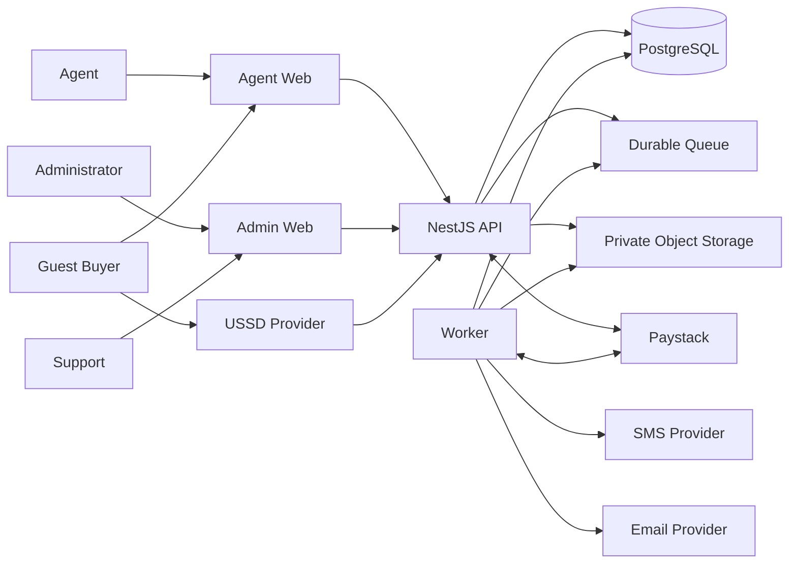

# System context and application architecture

Status: Accepted direction  
Last updated: 2026-07-30

## Architecture style

Doraf starts as a modular monolith. Business capabilities are separated into
NestJS modules with explicit ownership and interfaces, but they deploy as one
API codebase plus a worker process.

Microservices are not an MVP goal. A module is extracted only when measured
scale, security isolation, failure isolation, or team ownership justifies the
operational cost.

## Deployable applications

### Agent web

`apps/agent` is the Next.js application for:

- public agent-attributed storefronts,
- guest web checkout,
- payment status and retry,
- buyer voucher recovery, and
- the authenticated agent portal.

Public and authenticated routes share visual primitives but have separate
authorization and data-exposure rules.

### Administration web

`apps/admin` is the Next.js application for:

- Administrator workflows,
- Support investigation and complaint intake,
- operational dashboards and queues,
- inventory and pricing operations,
- withdrawal, refund, and dispute operations, and
- audit and reconciliation views.

### API

`apps/api` is the NestJS application that owns:

- authentication and authorization,
- product and financial business rules,
- database transactions,
- web and USSD checkout behavior,
- provider integrations and webhooks,
- administration commands,
- audit records, and
- query APIs for both web applications.

The Next.js applications do not independently calculate prices, balances,
payment outcomes, inventory allocation, or permissions.

### Worker

A separately running worker is built from the API codebase and uses the same
domain modules and database.

It processes:

- transactional outbox records,
- SMS and email delivery,
- payment verification,
- transfer reconciliation,
- reservation expiry,
- notifications,
- export generation,
- continuous integrity checks, and
- daily reconciliation.

API request processes do not perform long-running provider work inline.

## Supporting infrastructure

- PostgreSQL — canonical transactional and reporting source records
- Durable queue — job dispatch, retry scheduling, and worker coordination
- Private object storage — complaint evidence and generated exports
- Key and secret management — voucher encryption and provider credentials
- Central observability — structured safe logs, metrics, traces, and alerts

The current lean baseline uses Supabase for PostgreSQL and private file storage,
with Google Cloud Run, Cloud Tasks, Pub/Sub, Secret Manager, Cloud KMS, and
Cloud Logging. See
[Lean Supabase and Google Cloud infrastructure](lean-infrastructure-and-costs.md).
The earlier AWS baseline is superseded. Specific SMS, email, and USSD providers
remain open.

## Context diagram

## Trust boundaries

- Browsers and USSD requests are untrusted.
- Provider webhooks are untrusted until authenticated and matched to expected
  records.
- Next.js applications cannot bypass API authorization.
- Worker jobs are untrusted inputs until their source, type, and idempotency are
  validated.
- Object-storage links are private and short-lived.
- Support and Administrator access is least privilege and audited.
- Database access does not imply permission to decrypt voucher secrets.

## Next.js implementation rule

Before changing either Next.js application, implementation agents must read the
relevant documentation in `node_modules/next/dist/docs/` because the repository
uses Next.js 16.2 and its APIs and conventions may differ from older versions.
